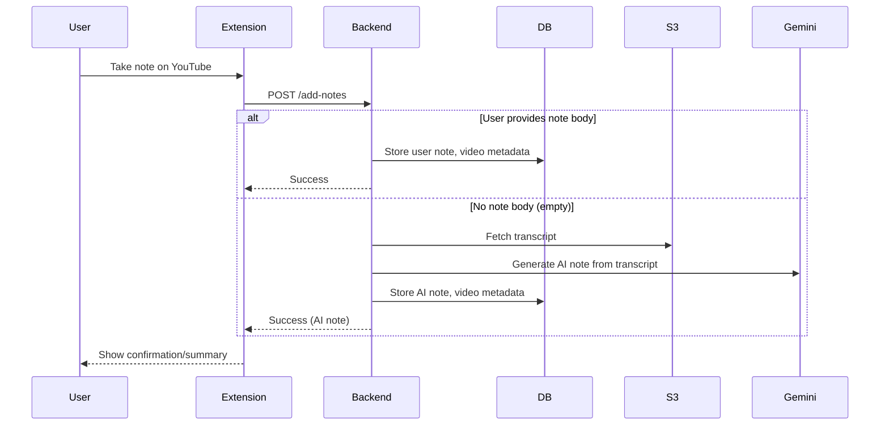

# Clipnote Architecture

## Overview

Clipnote is a web application and Chrome extension for saving timestamped notes on YouTube videos, organizing them with labels, and generating AI-powered summaries.

## Main Components

### 1. Backend (Flask API)

- Handles authentication (username/password, Google OAuth, guest)
- Manages users, notes, videos, labels, and favorites
- Integrates with external services: YouTube Transcript API, Apify, Google Gemini, AWS S3
- Provides REST API endpoints for extension and web frontend

### 2. Database (PostgreSQL)

- Tables: `video`, `notes`, `label`, `video_label`, `users`
- Stores user data, notes, video metadata, and label associations

### 3. Chrome Extension

- Popup UI for note-taking and authentication
- Content script for handshake with web page
- Uses `chrome.storage` for token management
- Communicates with backend API for CRUD operations

### 4. Web Frontend (Jinja2 Templates)

- Renders pages: home, login, dashboard, note, profile
- Interacts with backend via forms and AJAX

## Data Flow

1. User logs in via extension or web (token stored in extension/local storage)
2. User opens a YouTube video, takes a note (timestamp auto-captured)
3. Note is sent to backend, stored in DB, transcript fetched if new video
4. AI summary generated on request using Gemini and transcript
5. Notes and videos can be labeled, favorited, searched, and filtered

## Deployment

- Backend deployed via Render
- Extension loaded in Chrome (manifest.json)

---

## Sequence Diagram

